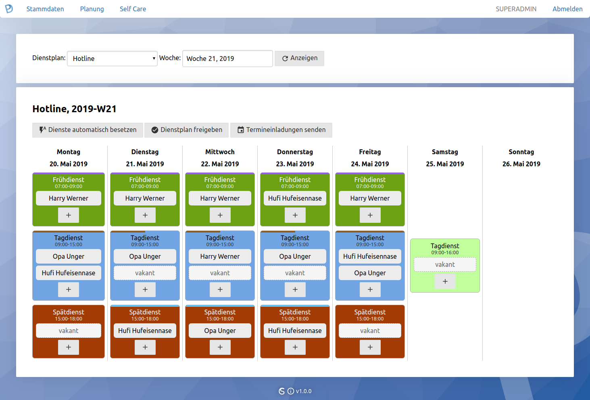
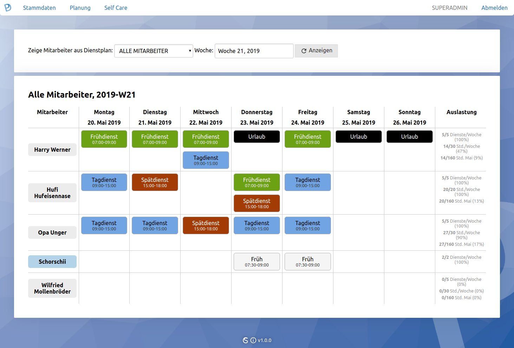
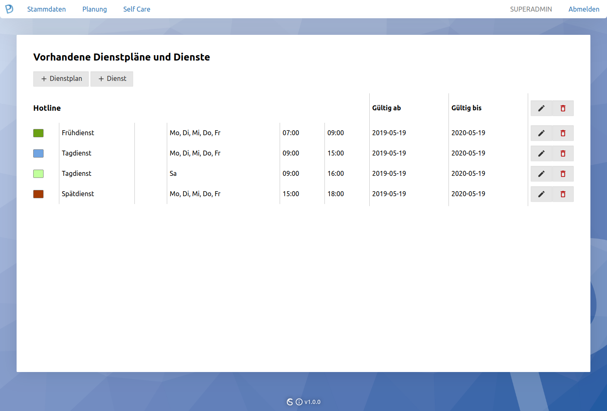

# 
*[[English Version](README.md)] web based open source workforce management*  
*[[Deutsche Version](README.de.md)] webbasierte Open Source Dienstplansoftware*

## Highlights
- The intuitive, browser-based user interface is self-explanatory and is completely platform-independent.
- The roster algorithm creates a weekly schedule fully automatically on the basis of the weekly and monthly working hours as well as the defined restrictions of an employee. You can fine-tune which services an employee cannot perform on certain days of the week.
- With the self-care portal, which can be activated as an option, employees can independently view and swap their services, fill vacant services and enter absences.
- Export function - output in PDF and HTML format for printing or embedding in collaboration systems or websites.
- LDAP connection for user import possible - connect MASTERPLAN e.g. to your Active Directory domain and employees can log in with the same password.
- It is possible to send appointment invitations for planned services via e-mail (for entering in the Thunderbird or Outlook calendar).
- Rights management - You can determine separate admins for each duty roster who are allowed to manage the plans and staff services.
- Integration into your corporate design (CD) possible.
- Program adjustments to your needs are possible on an offer basis - if you miss a function, simply contact me.

## System Requirements
### Client
The following web browsers are supported (JavaScript is mandatory).
- Google Chrome / Chromium, from version 70 (or newer)
- Opera, from version 60 (or newer)
- Vivaldi, from version 2.5 (or newer)
- Microsoft Edge, from version 44 (or newer)

The following web browsers are explicitly **not** supported at the moment.
- Microsoft Internet Explorer (all versions)
- Mozilla Firefox (all versions)
- Apple Safari (all versions)

### Server
#### Memory requirements
- 10 MiB hard disk space for the MASTERPLAN application
- plus storage space for the (growing) database
   - an estimated 0.2 MiB per employee per month
- at least 128 MiB PHP memory_limit

#### Software
- Operating system: any Linux distribution, recommendation: Debian
- Web server: Apache 2 + PHP 7 (or newer) with modules: LDAP, GD
- Database system: MySQL or MariaDB

## Quick Installation Guide
1. Install a Linux server according to the system requirements (incl. Apache, PHP, MySQL).
   ```
   apt install apache2 mysql-server php php-ldap php-gd
   ```
2. Set the recommended PHP memory limit:
   ```
   nano /etc/php/7.3/apache2/php.ini
   service apache2 restart
   ```
3. Create a database on your database server and import the database schema from `lib/sql/masterplan.sql` (e.g. via PHPmyadmin or the command line tool `mysql`).
4. Copy all files from the [latest release](https://github.com/schorschii/masterplan/releases/latest) to your web server root directory (e.g. `/var/www/masterplan`).
5. Edit the MASTERPLAN configuration file `conf.php`.
   1. Enter your access data for the database server (fill in the constants: `DB_HOST`, `DB_NAME`, `DB_USER`, `DB_PASS`).
   2. *(optional)* If you want to use the LDAP-Sync, please fill in the following constants accordingly: `LDAP_SERVER`, `LDAP_USER`, `LDAP_DOMAIN`, `LDAP_PASS`, `LDAP_QUERY_ROOT`, `LDAP_SYNC_GROUP`.
6. Grant the web server user (`www-data`) write permissions recursively for the directories `tmp` and `template` within your MASTERPLAN installation.
   ```
   cd /var/www/masterplan
   chown -R www-data tmp && chmod 0755 tmp
   chown -R www-data template && chmod 0755 template
   ```
7. If you would like to use MASTERPLAN functions that require e-mail to be sent (e.g. sending appointment invitations for services), please make sure that your mail system is set up correctly. MASTERPLAN uses the standard PHP function `mail()` for sending.
8. Call up MASTERPLAN in the web browser. You will be greeted by the setup wizard. Please select an administrator username and password for this. With a click on "Set up" the user is created and you can log in to the login mask.
9. Switch to the 'Master data'> 'Global settings' menu. Import your license file and enter your domain name.
10. Set up HTTPS on your web server so that the clients can access MASTERPLAN via an encrypted channel. You can find information on the Apache SSL module at: https://wiki.ubuntuusers.de/Apache/mod_ssl/
11. Set up a backup for the database. You can find information about a database backup here: https://wiki.ubuntuusers.de/MySQL/Backup/

## Configuration & Usage
Please read the user manual inside `frontend/manual`.

## Upgrade to a newer version
Please read the [upgrade notes](UPGRADE.md).

## Licensing
You can use MASTERPLAN with up to 5 users free of charge (donations for further development are welcome). A license is required for more than 5 users, which you can purchase [here](https://georg-sieber.de/?page=masterplan). For any questions, please [contact me](https://georg-sieber.de/?page=impressum).

## Translations & Contributions Welcome!
Please open a pull request for any improvements you like!

## Support & Cloud-Hosting
You do not have an own web server, you need support with installation or operation or want a special development for your company? No problem. You can use an cloud-hosted installation provided for a monthly fee per employee, use the e-mail support or receive offers for further development of the software. Please [contact me](https://georg-sieber.de/?page=impressum).

## Screenshots
  
  
  
  
  
  
  
  
  
